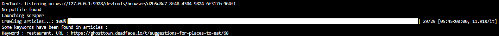

# OSINT Challenges

## The Selenium Scraper

To facilitate search in [Ghost Town](https://ghosttown.deadface.io/) (the social medium used by DEADFACE), I developped a little python script that will crawl the articles in this site, extract their raw HTML and will search for keywords in those articles.

The script will then print the urls found and the keywords associated.

This script is based on [selenium](https://pypi.org/project/selenium/) : a python package that allows us to pilot a web browser with python code.

Here we cannot use [requests](https://pypi.org/project/requests/) and [bs4](https://pypi.org/project/bs4/) because the site Gost Town uses a frontend framework : you need to execute javascript in order to render correctly the pages. That's why I had to use [selenium](https://pypi.org/project/selenium/).

Source code for the scrapper can be seen in `scraper.py`

To run it please grab the chromedriver copy that corresponds to your distribution and put it in the folder `chromedriver_win32`, change variable name `'chromedriver.exe'` line 11 by the name of the new chromedriver. Please verify you have installed Chrome browser. Please verify you have [Python3](https://www.python.org/downloads/) installed and install the project requirements `python -m pip install -r requirements.txt`.

You can then run the script by typing `python scraper.py keyword1 keyword2 ...` in your terminal.

Extracting content from the site can take up to 5 minutes, so I implemented a cache system allowing us to crawl the site only once and then use the data we have cached in a file.

You can launch the browser in normal mode or headless mode (line 83).

## Under Public Scrutiny

In this challenge, we are asked to find a [GitHub](https://github.com/) page corresponding owned by DEADFACE.

My first try was to use immediately my new custom scraper ! But every article in [Ghost Town](https://ghosttown.deadface.io/) actually has a github link embedded in its page ;(

I then simply used the search bar in the site for the string "github", and I found an article : [Ghost Town Article](https://ghosttown.deadface.io/t/made-a-github-link-for-projects/66)

In this article, the user `bumbyhassan` said he has created a github account for DEADFACE. In the replies he says `the account is deadf4c3`. I then went to [GitHub](https://github.com/) and searched for `deadf4c3`. I found the account and a [Public Project](https://github.com/deadf4c3/tarrasque), the flag is embedded in the `README.md` : flag{yAy_4_puBl1c_g1tHUB_rep0s}

## Fine Dining

In this challenge, we are asked to find the location of a hacker. We are also told that the father of a hacker owned a restaurant.

So I used my custom scraper to find if there was an article tamking about restaurants : `python scraper.py restaurant`

I had the following output :

So I went to the [Ghost Town Article](https://ghosttown.deadface.io/t/suggestions-for-places-to-eat/68) that was found by my scraper, and I found that the user `mirveal` said his father had a restaurant in "CA", and then publishes an article talking about his fathers restaurant :

We can see that the flag is embedded in the article : flag{b1sh0p-pig-n_T4LL}