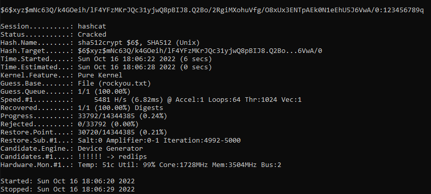
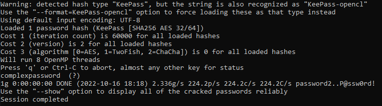
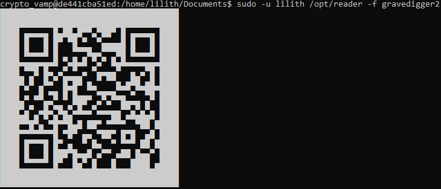
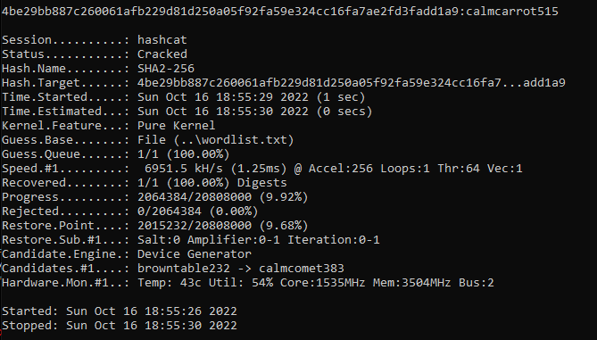

# Pwn challenges

## Easy Creds

For this challenge we are asked to break the password hash `$6$xyz$mNc63Q/k4GOeih/lF4YFzMKrJQc31yjwQ8pBIJ8.Q2Bo/2RgiMXohuVfg/O8xUx3ENTpAEk0N1eEhU5J6VwA/0`.

The two tools I use to break passwords are `HashCat` and `John The Ripper`.

Hashcat mainly runs on GPU when JtR runs on CPU (that means we can parallelise them), and JtR has a really interesting suite of tools that allows us to extract hashes readable by JtR from files (PDF, Word, KeePass, ...).

An interesting page to use is also [Hash Exemples](https://hashcat.net/wiki/doku.php?id=example_hashes) : it lists exemples of each hashes HashCat is able to crack and helps to find what kind of hash we have (The binary `hashid` present in Kali can also bee usefull but is less precise).

The hash is then of type `sha512crypt $6$, SHA512 (Unix) 2` (mode 1800 in hashcat).

I used HashCat with dictionnary attack (with rockyou.txt dictionnary) to crack the password (no need to use JtR here) : `hashcat.exe -m 1800 easy_creds.hash -a 0 rockyou.txt`

After 9 seconds we have the following output :



The password is then : 123456789q

## Database Crack

In this challenge we are given a KeePass database to crack into, the flag should be in the database.

A KeePass database is an encrypted file that can be decrypted only if you enter the correct master password.

I used a tool from JtR to extract the hash : `keepass2john.exe mySecret.kdbx > kdbx.hash`.

I tried to parallelise JtR and HashCat (mask + dictionnary attacks) to crack the hash, but after 12 hours of run, I decided to use another dictionnary : I found in Ghost Town while trying to solve other challenges that a hacker gives a dictionary he uses to crack passwords.

The dictionnary is tiny, so I used JtR to crack the password : `john.exe --wordlist=custom.dict.txt kdbx.hash`.

I had the following output :



The password is then : complexpassword

I realise I should have tried combinatory attack (dictionary 1 + dictionary 2) to break into this password, but OSINT saved the day here !

## Grave Digger 2

This challenge uses the same machine as `Grave Digger 1` (OSINT challenges).

We can connect with ssh to the machine using the creds given in Grave Diger 1 challenge.

By navigating in the folders we quickly find two interesting files in `lilith` repository `/home/lilith/Documents` : `gravedigger2` and `gravedigger2.png.txt`

But when I try to open them, I have a permission denied error : the files belong to user `lilith` and my current user `crypto_vamp` is not allowed to read those files.

I looked at the `sudo` (sudo is a program that allows to handle permissions in Linux systems) configuration for the user `crypto_vamp` : `sudo - l`

In the output it was said :

```
User crypto_vamp may run the following commands on de441cba51ed:
    (lilith) NOPASSWD: /opt/reader
```

It means that I am able to run the program /opt/reader with `lilith`'s permissions without having to provide any password.

I tried to read gravedigger2 using this technique : `sudo -u lilith /opt/reader -f gravedigger2`

I had the following output :



By scanning this QR Code (with normal phone app), we are able to see the flag : flag{d1091652793d0f31f53164353b6414e9}

Little comment here, we could have made privilege escalation to the role `lilith` for other challenges by using the command : `sudo -u lilith /opt/reader -c bash`

## Spectre WiFi

For this challenge we are given a sha256 hash : `4be29bb887c260061afb229d81d250a05f92fa59e324cc16fa7ae2fd3fadd1a9`

This hash represent the hash of a wpa key of a NETGEAR router.

I tried breaking this hash with conventional techniques (mask, dictionnary + rules,...) but after hours I couldn't break the hash.

I used my OSINT scrapper (see OSINT section) to see if there was any article in [Ghost Town](https://ghosttown.deadface.io/) that has the keyword `netgear` in it.

It found the following link : [Ghost Town Article](https://ghosttown.deadface.io/t/when-will-people-learn-about-defaults/79/3).

In this article, the hackers are talking about the compromise of the NETGEAR router we are working on. `deephax` says it is an old router and gives a link to an hashcat thread that discuss how wpa keys are crafted for those devices : [HashCat NETGEAR Thread](https://hashcat.net/forum/thread-4463.html)

This thread learns us that the wpa keys are crafted with the followinf syntax : `adjective + noun + XYZ` where noun is a word taken from a static list of nouns, adjective a word taken from a static list of adjectives, and X, Y and Z are numbers between 0 and 9.

I found a(n old) project on github that generates a wordlist with this list of nouns and adjectives (and even has an option to add the numbers after) : [GitHub link to adj.exe](https://github.com/wpatoolkit/Adj-Noun-Wordlist-Generator)

I generated the wordlist : `adj.exe -3 > wordlist.txt`

And then broke the hash with HashCat : `hashcat.exe -m 1400 new_wifi.txt -a 0 wordlist.txt`

I had the following output :



The wpa key is then : calmcarrot515