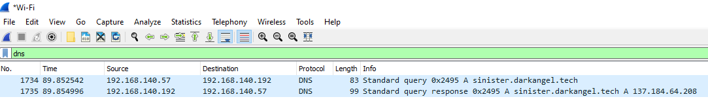

# Reverse challenges

## RansomWar1 - Let's Hash this out Fellas !

For this challenge we are given a ransomware : `darkangel-crypt-03.exe` and are asked to find it's sha512 hash value (for later IoC use probably).

We can easily achieve that using pythonn and the module `hashlib` (python source code is in sha512.py).

We find the hash `d5241cbd99afdd521fe9122b3ca77c8e2750a1fef050ecb88e6a5b91b74cf155fdae5b600e22ccceb97ad45a14fddf26394d066456969ed9e5514c8d681ebf44`

For the challenge we are asked to take the first 8 and last 8 chars : flag{d5241cbd681ebf44}

## RanswomWar2 - Indicators of you're Hosed !

I didn't have the time to finish this challenge, but I think I was not far from the answer so I'll write what I have done here.

We are asked to find one of the three IoCs (Indicator of Compromise) that can be extracted from the ransomware :

- Two urls the malware is connecting to
- The User-Agent used by the malware

I tried to find strings containing `http://` or `https://` in the binary using `Ghidra` (a reverse engineering tool), but I couldn't find anything.

It is said that this malware only encrypts files that are in the same repository than himself and having a `.dface` file extention.

So I tried to run the binary on a folder only containing the malware and a bullshit .dface file while runing `Wireshark` (a network traffic interceptor/pcap reader) to intercept my internet traffic.

I tried to look at http(s) traffic, but couldn't find what I wanted in the pcap.

I then tried to look at the DNS queries that have been made and finally I found something interesting !

We can see that there is a request of DNS resolution for `sinister.darkangel.tech` that is answered by the ip address `137.184.64.208`

With the ip address we can filter the TCP conversation using the filter `ip.addr == 137.184.64.208`

But the content is encrypted : the protocol used is `HTTPS` : `HTTP` over `TLS`/`SSL`. This also explains why I couldn't find this http traffic before with the regular http filter in wireshark.

Now we have to decrypt the packets to know the full URLs used and the User-Agent. I tried to set the environnement variable `SSLLOGKEYFILE` to a file so that I can log the SSL session keys generated from my computer (this environnement variable is used by underlying OpenSSL/Other Cryptographic libraries to log keys). I managed to log most of my keys but I dind't manage to decipher the conversation and finish the challenge.